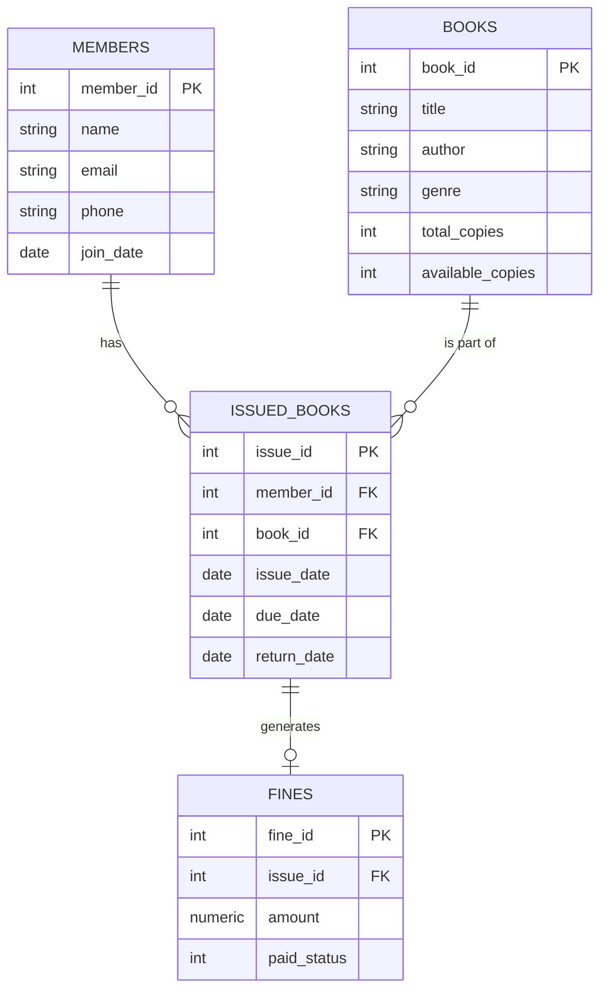

# Entity-Relationship Diagram

This diagram visually represents the relationships between the four core entities in our Library Management System database.

```mermaid
erDiagram
    MEMBERS {
        int member_id PK
        string name
        string email
        string phone
        date join_date
    }
    
    BOOKS {
        int book_id PK
        string title
        string author
        string genre
        int total_copies
        int available_copies
    }
    
    ISSUED_BOOKS {
        int issue_id PK
        int member_id FK
        int book_id FK
        date issue_date
        date due_date
        date return_date
    }
    
    FINES {
        int fine_id PK
        int issue_id FK
        numeric amount
        int paid_status
    }
    
    MEMBERS ||--o{ ISSUED_BOOKS : "has"
    BOOKS ||--o{ ISSUED_BOOKS : "is part of"
    ISSUED_BOOKS ||--o| FINES : "generates"
```
